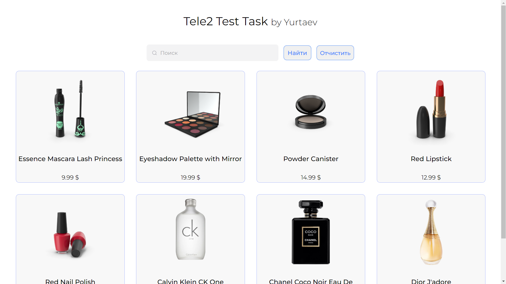
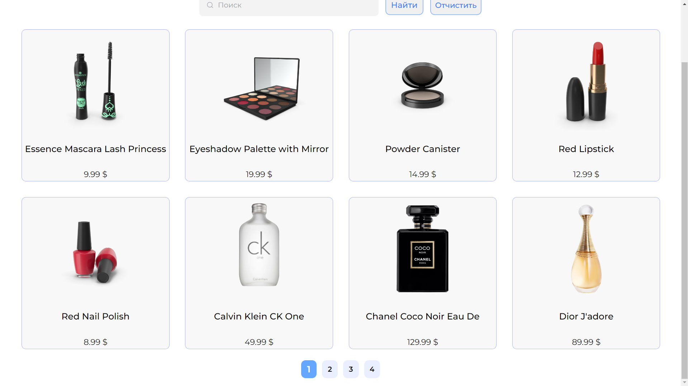
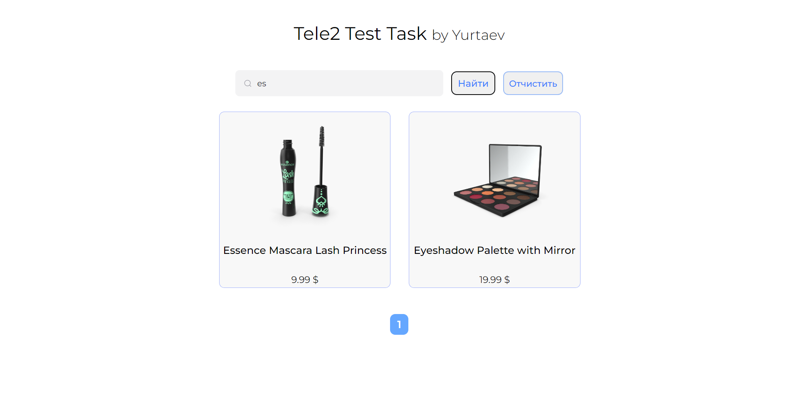
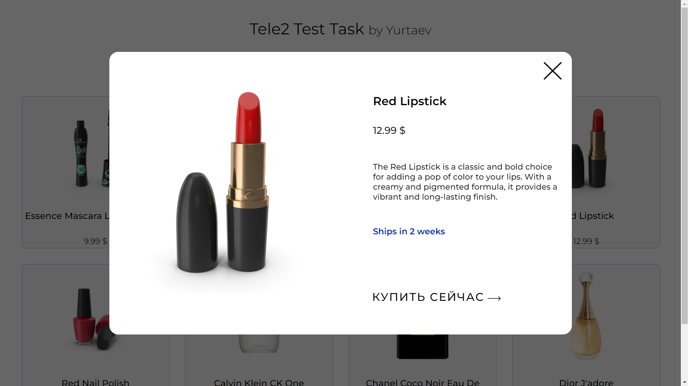

# ReadMe для Tele2-Test-Task

Выполнил Юртаев Владислав: [Резюме](https://disk.yandex.ru/i/sMLY77eD06BgyA)

## Навигация
- [Visual](#Visual)
- [Installation](#installation)
- [Usage](#usage)
- [Contributing](#contributing)
- [License](#license)

## Visual
# ---> [Видео-обзор тут](https://disk.yandex.ru/i/IHzkRIu83ag4yg) <---

## Installation
Чтобы установить проект:

1. Клонируйте репозиторий: `git clone https://github.com/Vladuk1love/Tele2-Test-Task-App.git`
2. Перейдите в рабочую дерикторию: `cd tele2-test-task-app`
3. Установите зависимости: `yarn` 

## Usage
Чтобы запустить проект:

1. **Запустите приложение**: `yarn start` 
2. Оно запуститься на `http://localhost:3000` 

3. Чтобы запустить тестирование: `yarn test`

##### **Приятного пользования!**
